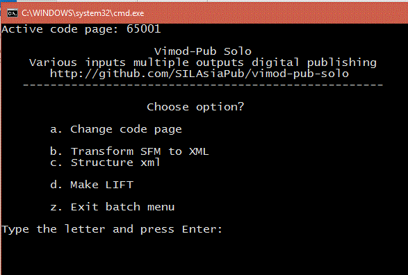

# Vimod-Pub-solo-sfm2lift

## Make a LIFT file from MDF schema SFM file

This project is set up to make one LIFT file. It makes use of the Vimod-Pub scripting menus and tasks. If you want to make multiple concordances this is not the best way to do it. If you want to make multiple LIFT files, then it is best to use the structure in Vimod-Pub project. https://github.com/SILAsiaPub/vimod-pub

The current setup does not handle sub-senses.

## To setup this tool:
* You must have iconv.exe installed in the subfolder pub\tools\iconv\bin. You can get this file from: http://gnuwin32.sourceforge.net/downlinks/libiconv-bin-zip.php
* You must have Java installed and either:
  * in the path 
  * or edit "pub\setup\user_installed_tools.var" and change the line 
      * # java=C:\Program Files\Java\jre8\bin\java.exe
      * change by removing the # and putting in your path to Java. i.e. replace the bit in [] brackets.
      * java=C:\[your-java-path]\bin\java.exe
       
## To setup your project variables. The step not to skip.

* Open the project.tasks file in the root of this project.
  * Edit the variables values in double quotes to suit your project. 
  * If your source is not UTF8 you must supply source-sfm-legacy variable. Do not edit the source-sfm-utf8 variable.
  * If you have a source in UTF8 already then edit source-sfm-utf8 variable.
  * Edit the variable iso so your files are tagged accurately. But it is not essential as it is only used in naming.
  * The fields-to-remove_list variable needs a space separated list of unwanted fields
  * The element-rename_list variable is an array of space separated key=value pairs. You may not need this. If you don't then comment out with a # at the start of the line: rename fields ;xslt generic-rename-elements
  * The element-lang_list variable is an array of space separated sfm=lang-code pairs. You will need to edit this for your project.
  * The note-value-substitute_underscore-list variable is an array of underscore separated contraction=expanded-contraction pairs. You can use this in note fields to change contractions into full words (as you should in an electronic dictionary). Non matching entries just return the value unchanges.
  * The form-element_list variable is a space separated list of elements that use the form element in LIFT. It may need aditions.
  * The note-element_list variable is a space separated array of sfm=label pairs. In it you define which SFMs will be output as note elements in LIFT and what the labeling you want in the note. I.e bw bw=from produces From: Turkish in the output. 
  * The relation-element_list variable is a space separated array of sfm=label pairs. In it you define which SFMs will be output as relation elements in LIFT and what the labeling you want in the relation. I.e sy=synonym produces Synonym: abba in the output with a link to abba.
  * The pos-value-substitute_underscore-list  variable is an array of underscore separated contraction=expanded-contraction pairs. This is used to expand cryptic abreviations into full words. You should edit this.
  * The gloss-element_list variable is a space separated list of definition sfm. It does not need changing unless you have more regional languages
  * The definition-group-element_list is a space separated list of Group sfm. Will not neeed to change.

* Open the project-add-xml-structure.tasks file in the root of the project
  * If you do not need to rename any SFMs the comment out the line
    * rename fields                           ;xslt generic-rename-elements
    * Is should now look like this
    * #rename fields                           ;xslt generic-rename-elements
  * If you have no elements to reorder then comment out the following line by placing a # at the beginning of the line.
    * If you have more fields to reorder then duplicate the line and change the element names to reorder.
    * The line following re orders the bw before the sn as it is a lexeme level comment. You write the one it will find first then the one to move to the front
    * reorder elements sn bw                  ;xslt generic-reorder-2nodes "serialnodes='sn bw'" 
  * Next is the line
    * remove empty elements                   ;xslt generic-remove-empty-except "remove-except_list='%remove-except_list%' remove-empty_list='%remove-empty_list%'"
    * This line removes empty fields except for the ones specified. sn may be one.
    * Parameters come from the project.tasks
    * More to come.
    *
    *
    *
    *

## To Run the process

* Start pub.cmd by double clicking on it from Windows Explorer. You should see the following
  * 
  * If you don't see the above, check Java is installed as above.
* Type the letter a and press enter to convert the legacy encoded SFM into UTF8
* Now step through each of the other steps.
* If you have a Yellow screen, something went wrong. Read what it says and try and fix it.
* At the end of step d the LIFT file is produced in the output folder.
